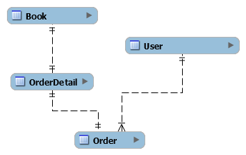

# Part 2 - Database

This section will focus solely on the design, requirements, attributes, relationships and normalization of the database to be implemented with our `API`

## Table of Contents

<!-- toc -->

- [Design](#design)
  - [Entities and Relationships](#entities-and-relationships)
  - [Pivot tables](#pivot-tables)
- [ER Diagram](#er-diagram)
- [Normalization](#normalization)
- [SQL Scripts](#sql-scripts)

<!-- tocstop -->

## Design

The database design for our library system revolves around three key entities:

- `Book`, `Order` and `User` and one pivot table: `OrderDetails`.

These entities encapsulate the basic/atomic details required to model our system.
Relationships are structured to ensure data integrity and to facilitate querying and manipulation.

According to our system's requirements, the design will be as follows:

- `User` can rent multiple `Books`, and `Books` can be rented by multiple `User`.
  - This relationship will be simplified by implementing an extra entity called `Order`.
- `Order` itself is a simple entity containing only a relationship to a _pivot table_.

### Entities and Relationships

- Book
  - PK: idBook
  - name
  - author
    - Can be another entity but wont for simplicity
  - stock
  - price
- User
  - PK: idUser
  - username
- Order
  - idOrder
  - FK: User_idUser

### Pivot tables

In addition to the previous tables,
we'll need to implement a pivot table in order to manage _M:N_ relationshps:

- OrderDetail
  - FK: Order_idOrder
  - FK: Book_idBook
  - quantity

## ER Diagram

En ER-Diagram will help us visualize the relationship between entities in our database.
In our library system the ER-Diagram will look something similar to the following:

## Normalization

Normalization is performed to minimize redundancy and dependency.
All in order to ensure a good structure and organization or the data.

There are three main steps to Normalization:

- First Normal Form (1NF)
  - Each table should have a primary key and atomic columns.
- Second Normal Form (2NF)
  - There aren't any composite primary keys nor partial dependencies.
- Third Normal Form (3NF)
  - All columns in a table are only dependent on the primary key.

## SQL Scripts

You can write (or generate) the SQL script through any tool you prefer.
Stick to the previously mentioned relationships and attributes for better results.
If you're using this as a resource, more than a guide,
then just remember to double check your requirements.
